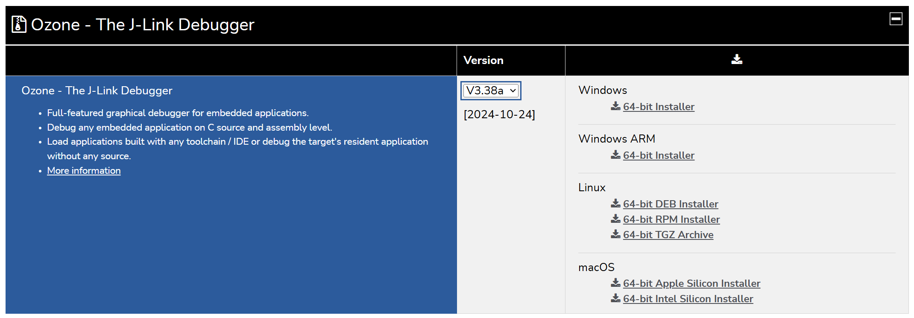
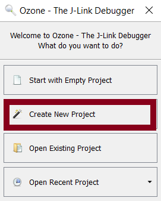
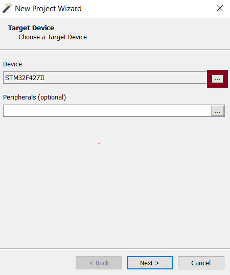
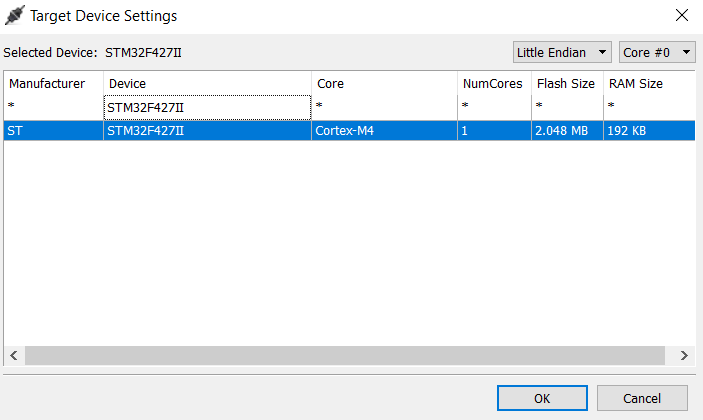
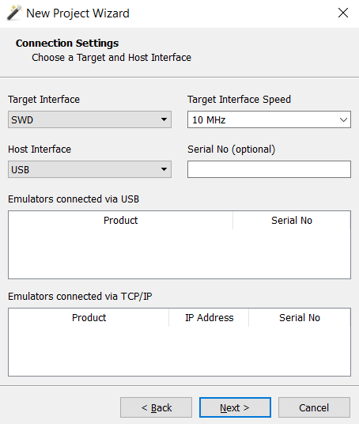

# Setting up ozone to deploy code to the robot

Ozone is a debuger made be Segger to be used with the J-Link tool.

## Installing Ozone

First you need to install ozone. Go to the [instalation page](https://www.segger.com/downloads/jlink/#Ozone) and scrol down to the "Ozone - The J-Link Debugger" tab. **Change the version to 3.38a**. Then install the correct one for your os and hardware.



## Seting up Ozone

Open ozone and select Create new project on the popup or, file -> new -> New Project Wizard.



From here you will be prompted to select a device. Below "Device", click the "...". 



Then in the search window that pops up, type in "STM32F427II" and double click on the result. 



Click next (no Peripherals are necessary).
The next page will prompt for connection settings. Select "SWD" for "Target Interface" and "USB" for
"Host Interface". For "Target Interface Speed", no particular speed is required, but 10 MHz is
what I use. The final settings are below. 



Click next. The setup will now prompt you for ELF file. This is the tricky part, since we are in a docker container. That means this will differ for os and how you setup docker. Choose the method you setup docker with.

## Pointing Ozone at the ELF

Ozone runs on the **host**, not in the container, so it needs two things:

1. A host-visible path to the `.elf` the container just built.
2. A mapping from the container's source paths (baked into the DWARF debug info) back to those same files as the host sees them — otherwise Ozone opens with "source file not found" on every frame.

Both come from the same pair of values: where the repo lives on your host, and where it lives inside the container. Find yours in the section for your setup below.

### The ELF path

Everything after the repo root is the same on every OS. Only the prefix changes.

```
<host-repo-root>/northstar-robomaster-project/build/<BUILD_DIR>/scons-<PROFILE>/TARGET_<ROBOT>/northstar-robomaster-project.elf
```

- `<BUILD_DIR>` — `hardware` for an ordinary firmware build, `hardware-profiling` if you built with profiling enabled. These are separate output trees, so both can exist at once and both will contain an ELF with the same filename. Check the timestamps if you are not sure which one your last build wrote.
- `<PROFILE>` — the build profile you actually built (`scons-debug`, `scons-release`, …). Use `debug` unless you have a reason not to; `release` builds are optimized and will single-step out of order.
- `<ROBOT>` — the target you built for, e.g. `TARGET_SENTRY`, `TARGET_HERO`.

> **Note**: If you want to change these settings (if moving to a diffrent robot or config) I recomend duplicating your saved .jdebug file and changing the .elf path by going to file -> Edit Project File, find the File.Open `("elf_path")` line, and modify the path, then save the file.

### The path substitution

Once the wizard has finished and you have saved the project, open `File > Edit Project File` and add a substitution to `OnProjectLoad()`:

```c
void OnProjectLoad (void) {
  // ...
  Project.AddPathSubstitute("<container-repo-root>", "<host-repo-root>");
}
```

`<host-repo-root>` is the same prefix you used for the ELF. `<container-repo-root>` is where that folder is mounted inside the container — `/workspaces/northstar-robomaster` if you are in the VS Code Dev Containers workflow, `/ws` if you built through `scripts/dev.sh`.

Each section below gives both values for that setup, plus the finished line to paste.

<details>
<summary><b>Windows — VS Code, cloned into a named volume</b></summary>

The volume lives inside Docker Desktop's WSL2 distro, which is reachable over UNC. Host repo root:

```
\\wsl.localhost\docker-desktop\mnt\docker-desktop-disk\data\docker\volumes\<VolumeName>\_data\northstar-robomaster
```

`<VolumeName>` is what you named the volume when you ran *Clone Repository in Named Volume…* (`Northstar` if you followed the setup guide). Paste the prefix into Explorer's address bar first to confirm it resolves before wiring it into Ozone.

Container repo root: `/workspaces/northstar-robomaster`

```c
Project.AddPathSubstitute("/workspaces/northstar-robomaster", "\\wsl.localhost\docker-desktop\mnt\docker-desktop-disk\data\docker\volumes\Northstar\_data\northstar-robomaster");
```

> **Note**: On older Docker Desktop versions the data lives in a separate distro — try `\\wsl.localhost\docker-desktop-data\data\docker\volumes\...` (or `\\wsl$\...` on older Windows builds) if the path above does not resolve. This whole path only exists on the WSL2 backend; with the Hyper-V backend there is no host-visible path to the volume.

</details>

<details>
<summary><b>Windows — cloned inside WSL2 (Reopen in Container, or CLI)</b></summary>

Host repo root:

```
\\wsl.localhost\<distro>\home\<you>\northstar-robomaster
```

Container repo root: `/workspaces/northstar-robomaster` in VS Code, `/ws` under `scripts/dev.sh`.

```c
Project.AddPathSubstitute("/workspaces/northstar-robomaster", "\\wsl.localhost\Ubuntu\home\you\northstar-robomaster");
```

</details>

<details>
<summary><b>Linux</b></summary>

There is no VM boundary, so the host repo root is just where you cloned it:

```
/home/<you>/northstar-robomaster
```

Container repo root: `/workspaces/northstar-robomaster` in VS Code, `/ws` under `scripts/dev.sh`.

```c
Project.AddPathSubstitute("/ws", "/home/you/northstar-robomaster");
```

</details>

<details>
<summary><b>macOS</b></summary>

The named-volume clone still works for everything else — this only affects Ozone. Docker Desktop keeps its VM in a disk image, so a named volume has **no** host-visible path: Finder and Ozone cannot reach either the ELF or the sources.

If you want to debug with Ozone on macOS, clone the repo onto the host filesystem and open it with *Dev Containers: Reopen in Container* (bind mount) instead of the named-volume flow. Host repo root:

```
/Users/<you>/northstar-robomaster
```

Container repo root: `/workspaces/northstar-robomaster` in VS Code, `/ws` under `scripts/dev.sh`.

```c
Project.AddPathSubstitute("/workspaces/northstar-robomaster", "/Users/you/northstar-robomaster");
```

</details>
<br>

> **Note**: Ozone does not apply C escape rules to these strings, so on Windows paste the UNC path exactly as Explorer shows it — single backslashes, no doubling. If you ever do hit a path-parsing error, forward slashes (`//wsl.localhost/docker-desktop/mnt/...`) are accepted as well.

If sources still do not resolve, check what the ELF actually recorded rather than guessing — Ozone's "file not found" dialog shows the path it is looking for, and inside the container `readelf --debug-dump=decodedline <elf> | head` will show the same prefix. Whatever that prefix is, is the first argument to `AddPathSubstitute`.